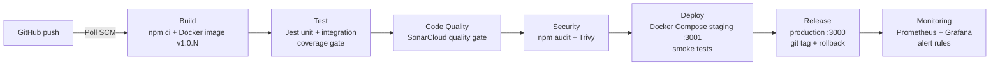

# SIT223 Unit Task Tracker

A Node.js + Express web app for tracking unit tasks, built on top of the original SIT223 unit information page, with a complete Jenkins CI/CD pipeline.

## Features
- Unit information home page (`/`) and a task tracker UI (`/tasks.html`)
- REST API: `GET/POST /api/tasks`, `GET/PUT/DELETE /api/tasks/:id`, `GET /api/tasks/summary`
- Input validation with clear error messages
- `/health` endpoint (status, version, environment, uptime)
- `/metrics` endpoint with Prometheus metrics (request count, latency, task count, Node.js stats)

## CI/CD pipeline (Jenkinsfile)



| Stage | Tools | Gate |
|---|---|---|
| Build | npm, Docker | Build must succeed; image tagged with version and commit |
| Test | Jest, Supertest, jest-junit | All tests pass, coverage >= 80% lines / 70% branches |
| Code Quality | SonarCloud | Quality gate must pass |
| Security | npm audit, Trivy | No HIGH/CRITICAL in production deps; no fixable CRITICAL in image |
| Deploy | Docker Compose | Staging must be healthy and pass smoke tests |
| Release | Docker Compose, Git tags | Production health check; automatic rollback on failure |
| Monitoring | Prometheus, Grafana | Production target UP; firing alerts mark the build UNSTABLE |

## Environments
| Environment | URL | Config |
|---|---|---|
| Staging | http://localhost:3001 | `deploy/staging.env` |
| Production | http://localhost:3000 | `deploy/production.env` |
| Prometheus | http://localhost:9090 | `monitoring/prometheus/` |
| Grafana | http://localhost:3002 (admin/admin) | `monitoring/grafana/` |

## Run locally
```
npm install
npm test
npm start          # http://localhost:3000
```
